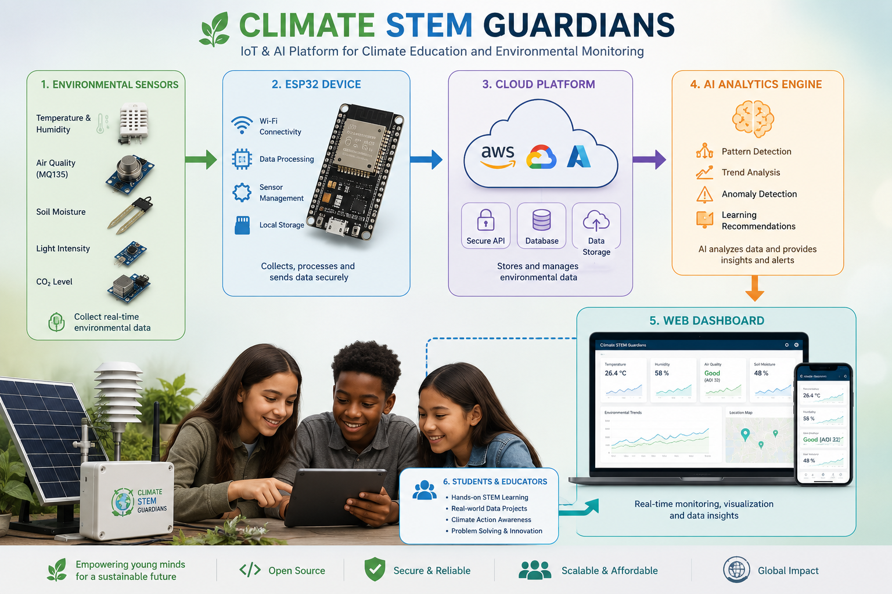

# Climate STEM Guardians

## Overview

Climate STEM Guardians is an open-source IoT and AI-powered educational platform designed to empower children and young people with practical climate and STEM skills. The platform enables students to collect, analyze, and visualize real-time environmental data while learning coding, electronics, and climate science through hands-on activities.

## Problem

Many schools, especially in low-resource communities, lack affordable tools for practical climate education. Students often learn climate science theoretically without opportunities to interact with real environmental data.

## Solution

Climate STEM Guardians combines environmental sensors, ESP32 microcontrollers, cloud technologies, and AI-driven analytics to create engaging climate education experiences. Students monitor local environmental conditions and develop innovative solutions to climate challenges.

## Technologies

- ESP32
- IoT
- Environmental Sensors
- Artificial Intelligence
- Data Science
- Cloud Computing

## Features

- Real-time environmental monitoring
- Interactive STEM activities
- AI-powered data analysis
- Teacher dashboard
- Student learning platform

## Repository Structure

```
firmware/
hardware/
docs/
platform/
```

## Installation

Coming soon.

## License

This project is released under the MIT License.


## System Architecture



## Project Structure

```
Climate-STEM-Guardians/
│── README.md
│── LICENSE
│── INSTALL.md
│
├── docs/
├── hardware/
├── firmware/
├── platform/
└── images/
```

## Roadmap

- ✅ Prototype completed
- 🔄 School pilot deployment
- 🔄 AI learning analytics
- 🔄 Mobile application
- 🔄 Open-source community contributions

## Contributing

We welcome contributions from developers, educators, researchers, and climate innovators. Please submit issues or pull requests to help improve Climate STEM Guardians.

## Contact

Email: ilham.boudarba@ramaqs.ma

GitHub: https://github.com/ilhamtune/Climate-STEM-Guardians
